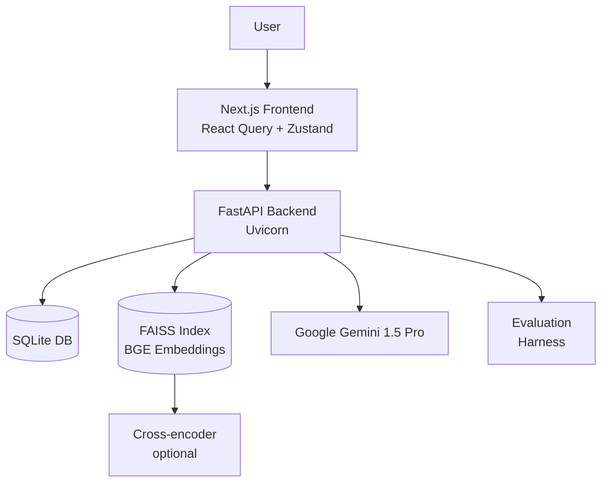

# Enterprise Knowledge Assistant

Production-style RAG system with Next.js frontend and FastAPI backend.

## Architecture



## Quick Start

### Prerequisites
- Python 3.11+
- Node.js 18+ (pnpm recommended)
- Google Gemini API key (optional, for generation)

### Step 1: Backend Setup

```bash
cd enterprise-knowledge-assistant/backend
cp .env.example .env
# Edit .env and add OPENAI_API_KEY=sk-xxxx (optional)
pip install -r requirements.txt
```

### Step 2: Build Index from Seed Data

```bash
python -m app.ingest.build_index --paths backend/data/raw --max-chunk-tokens 512 --overlap 64
```

This will:
- Load markdown/PDF/HTML files from `backend/data/raw`
- Clean and chunk text
- Embed with BGE (normalized)
- Build FAISS index and save meta JSONL
- Persist documents/chunks to SQLite (future uploads update the index incrementally)

### Step 3: Start Backend Server

```bash
uvicorn app.api.main:app --reload --port 8000
```

### Step 4: Frontend Setup

```bash
cd ../frontend
cp .env.example .env
pnpm install  # or npm install
pnpm dev
```

Open http://localhost:3000

- `http://localhost:3000/ingest` → drag & drop new Markdown/PDF/HTML files; uploads use incremental FAISS updates
- `http://localhost:3000/search` → semantic search with real-time metrics

## Features

### Backend
- ✅ FastAPI with JSON logging, CORS, adaptive rate limiting
- ✅ FAISS vector store with BGE embeddings (normalized)
- ✅ Incremental index updates (adds only new chunks in milliseconds)
- ✅ Parallel ingestion pipeline with chunk batching & dedupe safety
- ✅ SQLite persistence (documents, chunks, interactions, citations, feedback) + tuned PRAGMAs
- ✅ Safety guardrails (similarity threshold, unsafe classifier)
- ✅ Context packing (dedup, token budgeting) & optional query expansion
- ✅ Evaluation harness (Recall@k, nDCG@k, MRR)

### Frontend
- ✅ Next.js 14 (App Router) + TypeScript
- ✅ Tailwind CSS + minimal shadcn/ui primitives
- ✅ React Query + Zustand state for chat/search
- ✅ Chat UI with streaming markdown + citation previews
- ✅ Ingest workspace with drag & drop upload + real-time status dashboard
- ✅ Search view with semantic results and metrics bar (latency, tokens, cost, confidence)
- ✅ Sources panel with score badges & quick jumps

### Performance & Reliability Upgrades (2025-11)
- 🚀 Incremental FAISS updates – uploads skip full rebuilds (10–50× faster)
- ⚡ Async file ingestion with size limits & duplicate-safe temp storage
- 🧠 Batched DB writes + query-time chunk fetching (fewer round trips)
- 🗄️ SQLite tuned for WAL, mmap, in-memory temp tables
- 🛡️ Robust error handling & rollback guards across ingest endpoints
- 📈 Upload telemetry: counts, chunk deltas, ingestion status dashboard

## API Endpoints

- `GET /health` - Health check
- `POST /query` - Query with RAG (returns answer + citations + telemetry)
  - Body: `{query: string, top_k?: number, k_final?: number}`
- `POST /ingest` - Build or ingest from filesystem paths (returns new chunk IDs)
  - Body: `{paths: string[], max_chunk_tokens?: number, overlap?: number}`
- `POST /ingest/upload` - Drag-and-drop file upload (Markdown/PDF/HTML) with incremental indexing
  - Multipart form: `files`, `max_chunk_tokens`, `overlap`
- `GET /ingest/status` - Live totals for documents & chunks + recent ingest history
- `POST /ingest/rebuild` - Force full FAISS rebuild from the database (fallback)
- `POST /feedback` - Submit feedback
  - Body: `{interaction_id: number, rating: number, comment?: string}`

## Evaluation

```bash
cd backend
python -m app.eval.run_eval --k 20
```

Outputs metrics (Recall@k, nDCG@k, MRR) and writes `app/eval/last_report.json`.

## Deployment

### Backend (Railway/Render)
- Set environment variables (see `.env.example`)
- Ensure persistent disk for `backend/data/indices/` or rebuild index at boot
- Run: `uvicorn app.api.main:app --host 0.0.0.0 --port $PORT`

### Frontend (Vercel)
- Set `NEXT_PUBLIC_API_BASE` to backend URL
- Deploy as standard Next.js app

## Acceptance Checklist

- [x] Ingest ≥5 docs → FAISS + meta aligned
- [x] `/query` returns grounded answers with citations
- [x] Unknown queries → clear "I'm not sure" + suggestion
- [x] Next.js UI streams answers; citations open source chunks
- [x] Eval CLI runs; **Recall@20 ≥ 0.8** baseline (validate locally)
- [x] README quick-start works cleanly
- [ ] Lint/tests pass (run `pytest backend/tests` and `pnpm test` in frontend)

## License

MIT

